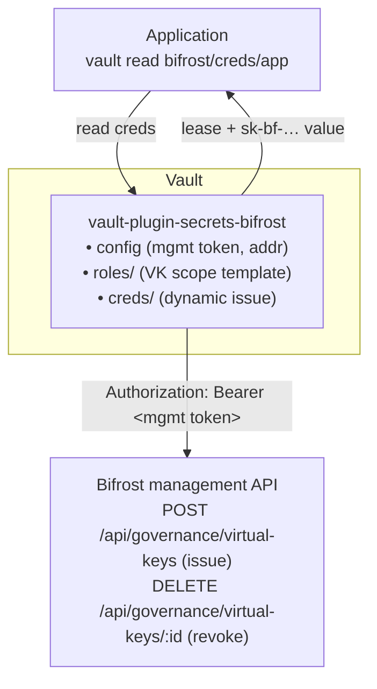

# vault-plugin-secrets-bifrost

> **Status: 🎨 Design phase.** No plugin code yet - the design is being finalised in [`docs/`](./docs). Build, install, and usage sections below are intentionally marked _TODO_ until the design is signed off.

A [HashiCorp Vault](https://www.vaultproject.io/) **secrets engine** plugin that dynamically manages credentials for [Bifrost](https://docs.getbifrost.ai/overview), the high-performance AI gateway.

Vault becomes the control plane for Bifrost access. Rather than long-lived, hand-distributed API keys, an application asks Vault for a Bifrost credential, uses it, and Vault revokes it when the lease expires. The MVP centres on Bifrost **virtual keys** (governance entities carrying budgets, rate limits, and per-provider scope); **provider API keys** follow as a second path.

## ⚠️ This is *not* Bifrost's built-in Vault backend

Bifrost already ships a native, enterprise **secret-consumption** feature: at runtime it reads `vault.<path>` references from a HashiCorp Vault (KV v2) to resolve provider keys. That makes **Bifrost a Vault *client***.

**This project runs the opposite way.** Here, **Vault is the *client* of Bifrost's management API**, *managing* (creating, leasing, revoking, rotating) Bifrost credentials.

| | Direction | Who calls whom |
|---|---|---|
| Bifrost native `hashicorp-vault` backend | Bifrost **reads** secrets from Vault | Bifrost → Vault |
| **This plugin** | Vault **manages** Bifrost credentials | Vault → Bifrost management API |

If you simply want to store existing provider keys in Vault and have Bifrost read them, use Bifrost's [built-in secret management](https://docs.getbifrost.ai/enterprise/secret-management) - not this plugin.

## Architecture

On `vault read bifrost/creds/<role>`, the engine asks Bifrost to create a virtual key scoped by the role, returns the `sk-bf-…` value to the caller, and ties it to a Vault lease. When the lease expires or is revoked, the engine deletes the virtual key in Bifrost.

## Documentation

The full design framework lives in [`docs/`](./docs). Start with [`docs/README.md`](./docs/README.md), which sets the reading order. Highlights:

- [Overview & goals](./docs/01-overview.md)
- [Architecture](./docs/02-architecture.md)
- [Vault plugin interface](./docs/03-vault-plugin-interface.md)
- [Bifrost integration](./docs/04-bifrost-integration.md)
- [Secrets engine paths](./docs/05-secret-engine-paths.md)
- [Lease lifecycle](./docs/06-lease-lifecycle.md)
- [Security](./docs/07-security.md)
- [Testing & dev](./docs/08-testing-and-dev.md)
- [Roadmap](./docs/09-roadmap.md)

## Quickstart

_TODO - pending design sign-off._ Will cover building the plugin binary, `vault plugin register`, enabling at a mount, writing `config` + a `role`, and reading `creds/<role>`.

## Building

_TODO - pending design sign-off._

## Licence

Released under the [Mozilla Public License 2.0](./LICENSE).
