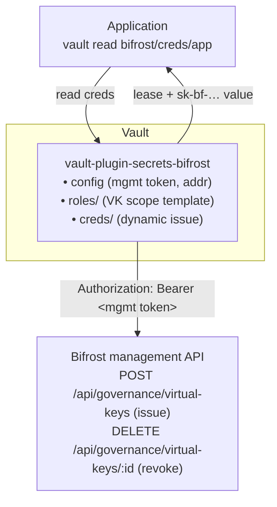

# vault-plugin-secrets-bifrost

> **Status: 🚧 Phase 1 (MVP) in progress.** The dynamic virtual-key path (`config`, `roles/<name>`, `creds/<role>`) is implemented with unit and backend tests against a mock Bifrost. Provider keys and static-role rotation are future phases (see [`docs/09-roadmap.md`](./docs/09-roadmap.md)). The Go module path is a placeholder (`github.com/example/...`) - see [Building](#building).

A [HashiCorp Vault](https://www.vaultproject.io/) **secrets engine** plugin that dynamically manages credentials for [Bifrost](https://docs.getbifrost.ai/overview), the high-performance AI gateway.

Vault becomes the control plane for Bifrost access. Rather than long-lived, hand-distributed API keys, an application asks Vault for a Bifrost credential, uses it, and Vault revokes it when the lease expires. The MVP centres on Bifrost **virtual keys** (governance entities carrying budgets, rate limits, and per-provider scope); **provider API keys** follow as a second path.

## ⚠️ This is *not* Bifrost's built-in Vault backend

Bifrost already ships a native, enterprise **secret-consumption** feature: at runtime it reads `vault.<path>` references from a HashiCorp Vault (KV v2) to resolve provider keys. That makes **Bifrost a Vault *client***.

**This project runs the opposite way.** Here, **Vault is the *client* of Bifrost's management API**, *managing* (creating, leasing, revoking, rotating) Bifrost credentials.

| | Direction | Who calls whom |
|---|---|---|
| Bifrost native `hashicorp-vault` backend | Bifrost **reads** secrets from Vault | Bifrost → Vault |
| **This plugin** | Vault **manages** Bifrost credentials | Vault → Bifrost management API |

If you simply want to store existing provider keys in Vault and have Bifrost read them, use Bifrost's [built-in secret management](https://docs.getbifrost.ai/enterprise/secret-management) - not this plugin.

## Architecture



On `vault read bifrost/creds/<role>`, the engine asks Bifrost to create a virtual key scoped by the role, returns the `sk-bf-…` value to the caller, and ties it to a Vault lease. When the lease expires or is revoked, the engine deletes the virtual key in Bifrost.

## Documentation

The full design framework lives in [`docs/`](./docs). Start with [`docs/README.md`](./docs/README.md), which sets the reading order. Highlights:

- [Overview & goals](./docs/01-overview.md)
- [Architecture](./docs/02-architecture.md)
- [Vault plugin interface](./docs/03-vault-plugin-interface.md)
- [Bifrost integration](./docs/04-bifrost-integration.md)
- [Secrets engine paths](./docs/05-secret-engine-paths.md)
- [Lease lifecycle](./docs/06-lease-lifecycle.md)
- [Security](./docs/07-security.md)
- [Testing & dev](./docs/08-testing-and-dev.md)
- [Roadmap](./docs/09-roadmap.md)

## Quickstart

Requires Go (the toolchain version is pinned in `go.mod`) and a Vault binary. The commands below use a local dev Vault and a mock or real Bifrost.

```sh
# 1. Build the plugin into a directory Vault can load.
make build            # -> vault/plugins/vault-plugin-secrets-bifrost

# 2. Run Vault in dev mode pointed at that directory.
vault server -dev -dev-root-token-id=root -dev-plugin-dir=./vault/plugins &
export VAULT_ADDR=http://127.0.0.1:8200 VAULT_TOKEN=root

# 3. Register the plugin and enable it at the bifrost/ mount.
make register

# 4. Configure the Bifrost connection (management bearer token).
vault write bifrost/config \
    address=https://bifrost.internal:8080 \
    management_token=$BIFROST_MANAGEMENT_TOKEN

# 5. Define a role templating the virtual key's scope.
vault write bifrost/roles/web-app \
    provider_configs='[{"provider":"openai","allowed_models":["gpt-4o"],"weight":1}]' \
    rate_limit='{"request_max_limit":1000,"request_reset_duration":"1h"}' \
    ttl=1h max_ttl=24h

# 6. Issue a dynamic virtual key. Revoking the lease deletes it in Bifrost.
vault read bifrost/creds/web-app
vault lease revoke <lease_id>
```

Rotate the management token on demand with `vault write bifrost/config/rotate-root management_token=<new>`. Rotation is operator-assisted: Bifrost has no confirmed API to mint management tokens, so you supply the replacement (see [`docs/06-lease-lifecycle.md`](./docs/06-lease-lifecycle.md)).

## Building

```sh
make build     # compile the plugin into vault/plugins/
make test      # unit + backend tests against a mock Bifrost
make testacc   # acceptance tests (needs BIFROST_ADDR + BIFROST_MANAGEMENT_TOKEN)
make lint      # go vet + gofmt
```

The Go module path in `go.mod` is currently the placeholder `github.com/example/vault-plugin-secrets-bifrost`. Rename it to the real org/repo once known - it is the only value that needs changing across imports.

## Licence

Released under the [Mozilla Public License 2.0](./LICENSE).
