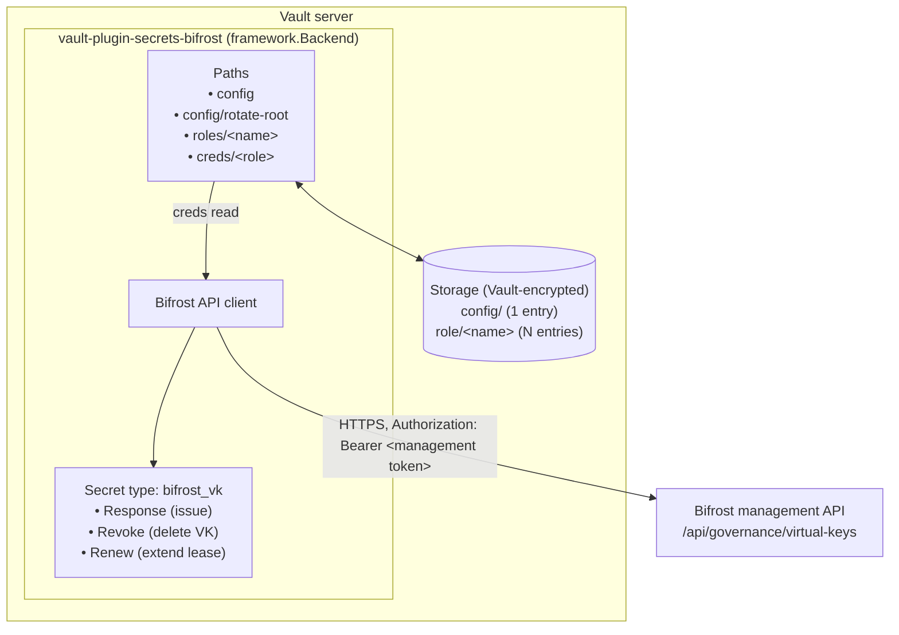
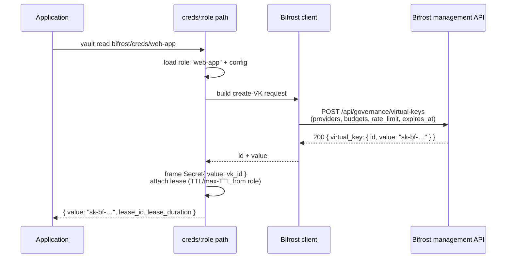
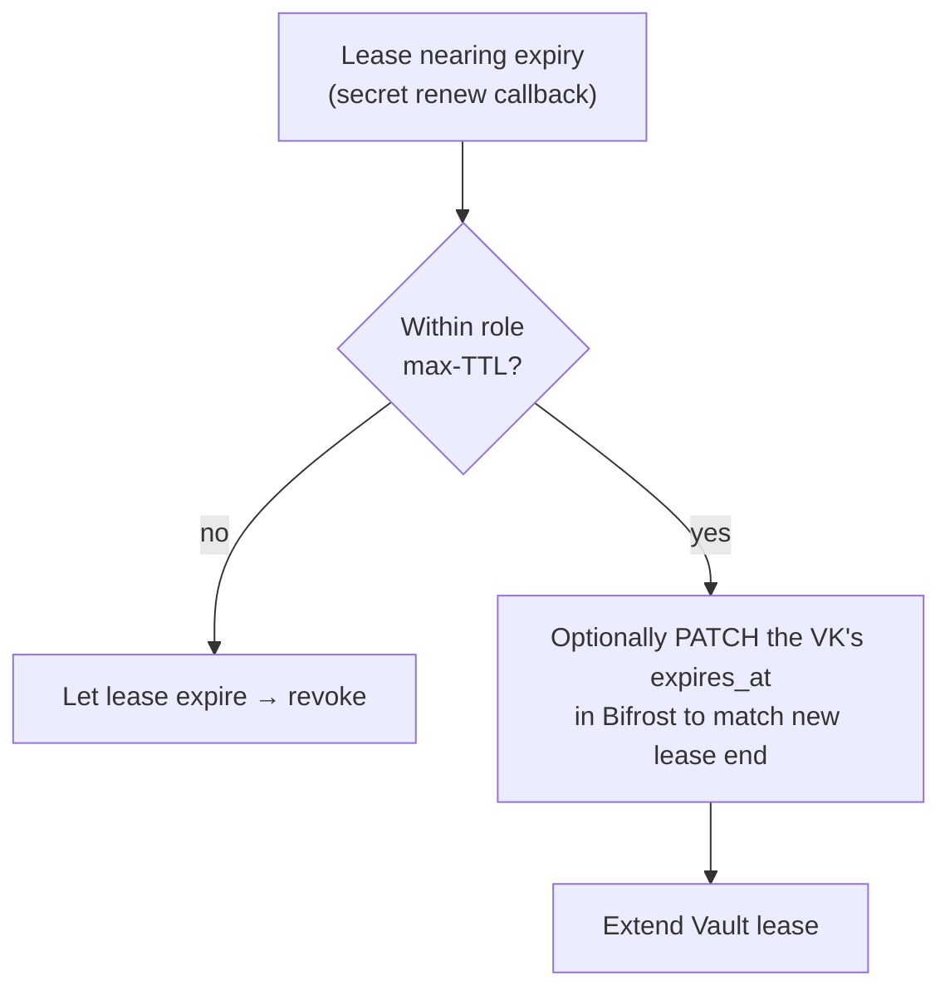
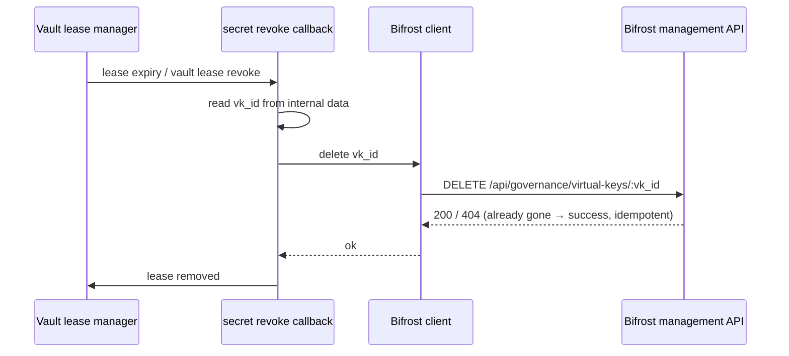

# 02 - Architecture

## Components

- **Backend** - a `framework.Backend` from the Vault SDK; owns path routing, storage, and the secret type.
- **Bifrost API client** - a thin Go HTTP client over the management API (see [04](./04-bifrost-integration.md)). Reads its base URL and bearer token from the `config` storage entry.
- **Storage** - Vault-encrypted backend storage holds the `config` entry and role definitions. It does **not** persist issued virtual key values; those live only in the lease's response and in Bifrost.
- **Secret type `bifrost_vk`** - defines the `Revoke` and `Renew` behaviour that Vault's lease manager invokes.

## Data flow - issue

## Data flow - renew

## Data flow - revoke

## Where secrets live

| Secret | Location | Notes |
|--------|----------|-------|
| Bifrost management (bearer) token | `config` storage entry, Vault-encrypted | Never returned to callers; rotatable via `config/rotate-root` |
| Issued virtual key `value` (`sk-bf-…`) | Returned in lease response; held in Bifrost | Not persisted in plugin storage; if lost, revoke + re-issue |
| Virtual key `id` | Internal `InternalData` of the lease's secret | Needed at revoke time |

## Reliability considerations

- **Partial failure on issue.** If Bifrost creates the VK but Vault fails to record the lease, the VK could leak. Mitigation: use a **WAL** (write-ahead log) entry written *before* the Bifrost call, rolled back (VK deleted) if the operation doesn't complete. Detailed in [03](./03-vault-plugin-interface.md) and [06](./06-lease-lifecycle.md).
- **Idempotent revoke.** A `404` from Bifrost on delete means the key is already gone - treat as success so leases can always be cleaned up.
- **Bifrost unavailable at revoke.** Vault retries revocation on its own schedule; the revoke callback should return a retryable error rather than dropping the lease.
