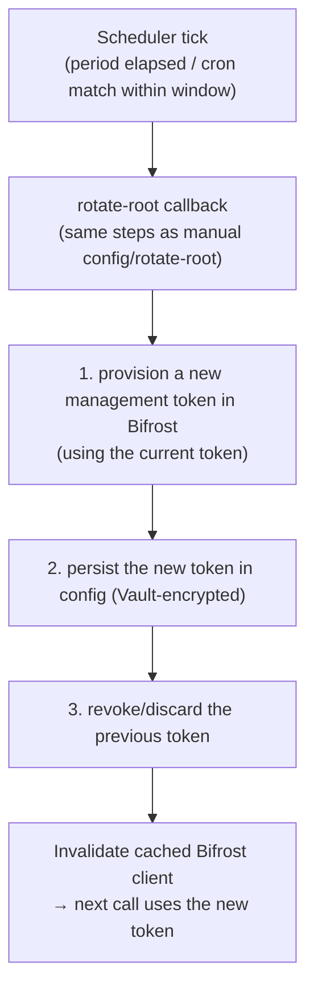

# 06 - Lease lifecycle

Bifrost virtual keys issued through `creds/<role>` are **leased dynamic secrets**. Vault's lease manager owns their lifetime; the engine reacts via the `bifrost_vk` secret's `Renew`/`Revoke` callbacks ([03](./03-vault-plugin-interface.md)).

## TTL model

| Source | Meaning |
|--------|---------|
| Mount tune `default_lease_ttl` / `max_lease_ttl` | Outer bounds for the whole mount |
| Role `ttl` / `max_ttl` | Per-role bounds, clamped to the mount bounds |
| Issued lease TTL | `min(role.ttl, mount.default)`; renewable up to `min(role.max_ttl, mount.max)` |

The engine sets `resp.Secret.TTL` and `resp.Secret.MaxTTL` from the role at issue time.

## Issue → active

1. `vault read bifrost/creds/<role>` creates the VK in Bifrost (see [04](./04-bifrost-integration.md)).
2. Lease created with the role's TTL.
3. Optionally, the VK's Bifrost `expires_at` is set to `≈ now + ttl` (`set_expires_at`) as a **backstop** - if Vault revocation is ever delayed or lost, Bifrost still expires the key.

## Renewal

`secretVKRenew`:

- If `now + requested_increment` exceeds the role `max_ttl` → refuse extension; the lease runs to its current end, then revokes.
- Otherwise extend the Vault lease. If `set_expires_at` is on, `PUT` the VK to push its `expires_at` forward so the backstop stays ahead of the lease.
- Renewal does **not** create a new key - it's the same `vk_id` throughout the lease's life.

## Revocation

Triggered by lease expiry, explicit `vault lease revoke`, or mount/role teardown.

`secretVKRevoke`:

1. Read `vk_id` from `req.Secret.InternalData`.
2. `DELETE /api/governance/virtual-keys/<vk_id>`.
3. `404` ⇒ success (idempotent). `5xx`/network error ⇒ return a **retryable** error; Vault retries on its schedule so the key isn't orphaned.

Bulk revocation (`vault lease revoke -prefix bifrost/creds/`) fans out to per-lease revokes.

## Orphan prevention (WAL)

The dangerous window is: Bifrost created the VK, but Vault didn't persist the lease (crash/restart between the two).

- Before calling Bifrost, `PutWAL({role})`.
- On success, the WAL is deleted; the lease's `InternalData` is the source of truth.
- `WALRollback` (periodic, gated by `WALRollbackMinAge` so in-flight requests aren't clobbered) reconciles: any VK created for a WAL that never completed is deleted in Bifrost.

## Root (management token) rotation

The management token in `config` is the engine's own privileged credential. It is rotated on a **user-configurable schedule** so a long-lived secret never sits in Vault storage indefinitely. This is independent of issued-key leases: rotating the root token swaps the credential the engine uses to call Bifrost and does **not** touch or invalidate already-issued virtual keys, which are separate Bifrost entities.

### Configuring the timeframe

Rotation cadence is set on `config` ([05](./05-secret-engine-paths.md)) using Vault's standard `automated_rotation` parameters:

- `rotation_period` - a simple interval, e.g. `rotation_period=720h` rotates roughly monthly. Time-based from the last rotation.
- `rotation_schedule` - a cron expression for calendar-aligned rotation, e.g. `rotation_schedule="0 0 1 * *"` (00:00 on the 1st of each month), optionally bounded by `rotation_window`.
- The two are mutually exclusive. Setting neither (`rotation_period=0`) leaves rotation manual-only.
- `disable_automated_rotation=true` suspends the schedule without discarding it.

### How automatic rotation runs

Vault's rotation manager owns the schedule; the engine registers the root credential with it at `config` write time and reacts via a rotation callback:

The manual `config/rotate-root` write and the scheduled callback share one code path, so behaviour is identical whichever triggers it. Rotation is a single-writer operation guarded so overlapping ticks (or a manual trigger racing the scheduler) cannot run concurrently; in a cluster it runs on the primary/active node only.

### Rotation failure handling

- **Bifrost unreachable / provisioning fails.** Keep the current token in place, log and surface the error, and let the scheduler retry on the next tick (or within `rotation_window`). The engine never leaves `config` without a working token.
- **New token persisted but old-token revoke fails.** The new token is already active, so the engine proceeds; the stale old token is queued for a best-effort revoke retry and flagged for operator attention.
- **Dependency caveat.** Automatic rotation needs Bifrost to provision a replacement token programmatically. Until that endpoint is confirmed ([05](./05-secret-engine-paths.md), [09](./09-roadmap.md)), the scheduled callback degrades to operator-assisted: it fires an alert at each tick (and accepts an operator-supplied token) rather than minting one itself.

## Failure-mode matrix

| When | Failure | Outcome |
|------|---------|---------|
| Issue | Bifrost 5xx | Read fails; WAL rollback removes any partial VK; no lease |
| Issue | Vault crash after create, before lease persist | WAL rollback deletes the orphaned VK |
| Renew | Past max_ttl | Extension refused; lease expires then revokes |
| Revoke | Bifrost down | Retryable error; Vault retries; backstop `expires_at` also protects |
| Revoke | VK already deleted (404) | Treated as success |
| Root rotation | New token provisioning fails | Keep current token; log/alert; retry next tick |
| Root rotation | Old-token revoke fails after swap | Proceed on new token; queue stale token for best-effort revoke |

## Clock & timezone

`expires_at` is sent as RFC3339 UTC. The engine relies on Vault's lease clock as the primary authority; `expires_at` is only a backstop, so minor clock skew between Vault and Bifrost is non-critical but should be small.
