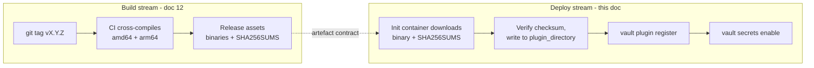
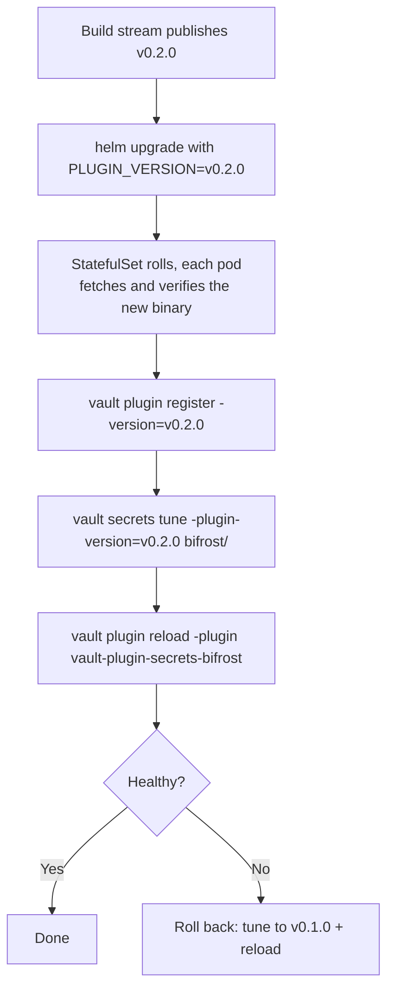

# 11 - Kubernetes deployment (consuming the artefact)

How to get a **published** `vault-plugin-secrets-bifrost` artefact into a Vault cluster running on Kubernetes, register it, and enable it.

This document covers the **consumer** side only. Producing and publishing the artefact is [12](./12-build-and-release.md). The two are independent: anything satisfying the contract below can be deployed by following this document, and the build stream can change how it builds as long as the contract holds.

Vault external plugins are **native binaries executed by the Vault process** - not containers, not Go plugins loaded at runtime. The binary must exist on the filesystem of every Vault pod, inside the directory named by `plugin_directory`, before you register it. Everything below follows from that one constraint.

## The artefact contract

The only coupling between this document and [12](./12-build-and-release.md).

| Property | Value | Consumed by |
|----------|-------|-------------|
| Artefact type | GitHub Release assets (native binaries, no registry) | Init container download |
| Release URL | `https://github.com/globallogicuki/vault-plugin-secrets-bifrost/releases/download/vX.Y.Z/` | Init container download |
| Binary asset names | `vault-plugin-secrets-bifrost_X.Y.Z_linux_amd64`, `..._linux_arm64` | Init container download |
| Checksum asset | `SHA256SUMS`, `sha256sum` format (hex, two spaces, filename) | `vault plugin register -sha256=` |
| SBOM assets | `<binary>.spdx.json` per binary | Supply-chain review, optional |
| Provenance | SLSA build provenance per binary, `gh attestation verify` | Release gating, optional |
| Architectures | `linux/amd64`, `linux/arm64` | Node pool must match |
| Version scheme | Tag `vX.Y.Z`; assets carry the bare `X.Y.Z` | `-version` / `-plugin-version` |
| Tag immutability | Tags are never moved and releases are never re-cut | A pinned version is a fixed set of bytes |

Note the two spellings of one version. The tag and Vault's plugin catalogue use `v0.1.0`; asset filenames use `0.1.0`. The snippets below hold the tag in one variable and strip the `v` where needed. See [12](./12-build-and-release.md) for the rule.

The checksum comes **out of the published artefact** (`SHA256SUMS`), not out of band. No copying hashes between teams, and no risk of registering a checksum from a different build. The consumer extracts the one line it needs, because `SHA256SUMS` covers both architectures.



## Prerequisites

| Requirement | Why |
|-------------|-----|
| `plugin_directory` set in the Vault server config | Vault refuses to register a plugin without it. Cannot be a symlink. |
| `api_addr` set | The plugin process dials back to Vault over the API. The Helm chart sets this for you in HA mode. |
| Binary arch matches the nodes | `linux/amd64` or `linux/arm64`. The init container below detects this with `uname -m`. |
| Egress to `github.com` from the cluster, or a mirror | The init container downloads the release assets. See the air-gapped note in step 1. |
| A token with `sudo` on `sys/plugins/catalog/*` | Registration is a privileged operation. |

## Step 1 - Choose how the binary reaches the pods

| Option | How | Best for | Trade-off |
|--------|-----|----------|-----------|
| **A. Downloading init container** (recommended) | Init container fetches the binary and `SHA256SUMS` from the release, verifies, and writes into a shared `emptyDir` mounted at `plugin_directory` | Most clusters. GitOps-friendly, nothing to rebuild | Needs egress to `github.com`; downloads on every pod start |
| **B. Custom Vault image** | `FROM hashicorp/vault:<ver>` + `COPY` the verified binary | Air-gapped clusters, or teams already rebuilding the Vault image | You now own Vault image rebuilds and CVE patching |
| **C. Persistent volume** | Pre-seed a RWX volume with the binary | Non-OCI workflows | Manual, drifts easily, awkward with StatefulSet scaling |
| **D. Plugin-carrying OCI image** | Init container copies the binary out of a purpose-built image | Registry-centric platforms | **Deferred** - no such image is published. See [12](./12-build-and-release.md) |

`emptyDir` is wiped on every pod restart, so whatever populates it must be re-fetchable on demand. That is why a hand-copied binary (`kubectl cp`) is a smoke test only - it will not survive a restart. It is also why option A repeats the download on every pod start: acceptable for a ~25 MB binary, but it makes `github.com` a dependency of pod startup. If that is unacceptable, use option B, or point the init container at an internal mirror of the two assets.

Option A honestly assessed:

- **Needs egress** to `github.com` (and its CDN) from the Vault namespace. Check any `NetworkPolicy` and egress proxy.
- **No digest pinning.** You pin a version, not a content digest as you would with an image. The checksum verification is what closes that gap: a substituted binary fails `sha256sum -c` and the pod never starts.
- **Public repository assumed.** If the repository is ever made private, the init container needs a token, which means a `Secret` and a rotation story.
- **Repeated downloads.** Every pod restart re-fetches. A transient GitHub outage becomes a failure to start a Vault pod.

Option A is described in full below.

## Step 2 - Helm values

The official [`hashicorp/vault`](https://github.com/hashicorp/vault-helm) chart exposes `server.volumes`, `server.volumeMounts`, and `server.extraInitContainers`, which is all this needs. `server.volumes` and `server.volumeMounts` apply to **all** containers in the pod, including init containers - so the init container and Vault itself see the same `emptyDir`.

```yaml
# values.yaml
server:
  volumes:
    - name: plugins
      emptyDir: {}

  volumeMounts:
    - name: plugins
      mountPath: /vault/plugins
      # NOTE: not readOnly - the init container has to write here.
      # See the readOnly caveat below.

  extraInitContainers:
    - name: bifrost-plugin
      # Any small image with curl and sha256sum. curlimages/curl is Alpine
      # based, so busybox provides sha256sum.
      image: curlimages/curl:8.11.1
      imagePullPolicy: IfNotPresent
      env:
        - name: PLUGIN_VERSION       # the git tag, with the leading v
          value: v0.1.0
      command:
        - sh
        - -ec
        - |
          NAME=vault-plugin-secrets-bifrost
          BASE=https://github.com/globallogicuki/$NAME/releases/download/$PLUGIN_VERSION

          # Asset filenames carry the bare X.Y.Z, not the tag's v.
          VERSION=${PLUGIN_VERSION#v}

          case "$(uname -m)" in
            x86_64)  ARCH=amd64 ;;
            aarch64) ARCH=arm64 ;;
            *) echo "unsupported arch $(uname -m)"; exit 1 ;;
          esac

          ASSET="${NAME}_${VERSION}_linux_${ARCH}"
          cd /vault/plugins

          curl -fsSL --retry 3 --retry-all-errors -O "$BASE/$ASSET"
          curl -fsSL --retry 3 --retry-all-errors -O "$BASE/SHA256SUMS"

          # SHA256SUMS covers both architectures, so verify only our line.
          # busybox sha256sum has no --ignore-missing.
          grep " ${ASSET}$" SHA256SUMS > SHA256SUMS.this
          sha256sum -c SHA256SUMS.this

          # Hand the published hash to step 3 rather than recomputing it.
          awk '{print $1}' SHA256SUMS.this > "$NAME.sha256"

          mv "$ASSET" "$NAME"
          chmod 0755 "$NAME"
          rm -f SHA256SUMS SHA256SUMS.this
      volumeMounts:
        - name: plugins
          mountPath: /vault/plugins

  ha:
    enabled: true
    raft:
      enabled: true
      config: |
        ui = true

        listener "tcp" {
          tls_disable = 1
          address = "[::]:8200"
          cluster_address = "[::]:8201"
        }

        storage "raft" {
          path = "/vault/data"
        }

        service_registration "kubernetes" {}

        # Required for external plugins.
        plugin_directory = "/vault/plugins"
```

Two properties of that script matter:

- **`curl -f` and `sha256sum -c` both fail the init container**, so a bad download or a substituted binary stops the pod rather than producing a Vault that fails at registration time with `checksums did not match`.
- **The hash written to `$NAME.sha256` is the published one**, taken from `SHA256SUMS`. Recomputing it locally would only prove the file did not change since it was written, which is not the property `vault plugin register` needs.

### The `readOnly` caveat

The Helm docs show `volumeMounts` with `readOnly: true`, which is correct once the binary is in place but breaks the init container's write, because the same mount list applies to every container. Two ways round it:

1. **Omit `readOnly`** (as above). Simplest; the directory is writable by Vault, a minor hardening loss on an `emptyDir` private to the pod.
2. **Give the init container a separate `mountPath`** onto the same volume, so it is not subject to the read-only entry:

```yaml
  volumeMounts:
    - name: plugins
      mountPath: /vault/plugins
      readOnly: true
  extraInitContainers:
    - name: bifrost-plugin
      image: curlimages/curl:8.11.1
      # ... same script, with `cd /staging` instead of `cd /vault/plugins`
      volumeMounts:
        - name: plugins
          mountPath: /staging      # same volume, writable path
```

Prefer option 2 if policy requires read-only mounts on the Vault container.

### Permissions and `mlock`

- The chart runs Vault as **uid 100 / gid 1000** with `fsGroup: 1000`, so files written by the init container into the `emptyDir` are group-readable by Vault. The explicit `chmod 0755` makes this unambiguous.
- The chart sets **`disable_mlock = true`** by default, so the `setcap cap_ipc_lock=+ep` step from the Vault docs does **not** apply. If you re-enable `mlock`, add the `IPC_LOCK` capability and `setcap` the plugin binary as well as Vault's.
- Leave `VAULT_ENABLE_FILE_PERMISSIONS_CHECK` unset, or the stricter ownership checks will reject the written binary unless you also set `plugin_file_uid` and `plugin_file_permissions`.

Apply:

```sh
helm upgrade --install vault hashicorp/vault -n vault --values values.yaml
```

Populating via init container makes this a **rolling change to the StatefulSet** - each pod gets the binary as it restarts. Unseal each pod as it returns if you are not using auto-unseal.

### Optional: verify provenance before deploying

The init container verifies integrity but cannot verify *origin* - `gh attestation verify` needs the `gh` CLI and network access to GitHub's attestation API, which does not belong in a startup path. Do it once, out of band, when qualifying a version:

```sh
TAG=v0.1.0; REPO=globallogicuki/vault-plugin-secrets-bifrost
gh release download "$TAG" -R "$REPO" -p 'vault-plugin-secrets-bifrost_*_linux_*' -p SHA256SUMS
gh attestation verify vault-plugin-secrets-bifrost_"${TAG#v}"_linux_amd64 -R "$REPO"
```

That proves the binary was built by this repository's release workflow. Record the verified `SHA256SUMS` contents in the change ticket; the init container then reproduces the same hashes on every pod.

## Step 3 - Register and enable

Run once against the **active** node. The plugin catalogue lives in Vault's storage, so registration replicates to all nodes - but the binary must already be on each of them, which step 2 guarantees.

```sh
kubectl exec -n vault vault-0 -- sh -ec '
  vault plugin register \
    -sha256="$(cat /vault/plugins/vault-plugin-secrets-bifrost.sha256)" \
    -command=vault-plugin-secrets-bifrost \
    -version=v0.1.0 \
    secret vault-plugin-secrets-bifrost

  vault secrets enable -path=bifrost \
    -plugin-version=v0.1.0 \
    vault-plugin-secrets-bifrost
'
```

If you are registering from a copy of `SHA256SUMS` rather than the sidecar file - a manual install, or option B - pull out the line for your architecture instead of pasting a hash:

```sh
ARCH=amd64
vault plugin register \
    -sha256="$(awk -v a="$ARCH" '$2 ~ "_linux_"a"$" {print $1}' SHA256SUMS)" \
    -version=v0.1.0 \
    secret vault-plugin-secrets-bifrost
```

Registering with `-version` lets you stage a new build alongside the old one and cut over per-mount, which is what makes the upgrade path below safe.

Verify:

```sh
vault secrets list -detailed | grep bifrost
vault plugin list secret -detailed | grep bifrost
```

Check that the registered version and SHA256 are the ones you intended.

> **Caveat:** the plugin does not yet report its own version to Vault, so **Running Version is blank** in `vault plugin list`. Vault still enforces the registered SHA256 on every plugin launch, so this is a reporting gap, not a verification gap. Populating it needs a version string compiled into the binary, which changes the binary's bytes and therefore its checksum - so it is a deliberate follow-up rather than part of the first release. Compare the registered `-version` and SHA256 against `SHA256SUMS` in the meantime.

## Step 4 - Configure the engine

The management token is a secret - do not put it in Helm values or a ConfigMap. Write it through the API:

```sh
kubectl exec -n vault vault-0 -- sh -ec '
  vault write bifrost/config \
    address="http://bifrost.bifrost.svc.cluster.local:8080" \
    management_token="'"$BIFROST_MANAGEMENT_TOKEN"'"

  vault write bifrost/roles/demo \
    provider_configs="[{\"provider\":\"openai\",\"allowed_models\":[\"gpt-4o\"]}]" \
    ttl=1h

  vault read bifrost/creds/demo
'
```

Network path: Vault pods must reach Bifrost's management API. If you run `NetworkPolicy`, allow egress from the Vault namespace to Bifrost on its management port - and, for option A, to `github.com` as well. The plugin runs as a **child process of the Vault pod**, so it shares the pod's network identity - no separate policy for the plugin itself.

## Upgrades



`secrets tune` plus `plugin reload` is a fast rollback needing no pod restart - **provided both binaries are still on disk**. So during a transition the init container must fetch both versions under distinct filenames, or you lose the rollback. Keep the old version registered until the new one is proven.

## Kubernetes-specific gotchas

| Symptom | Cause |
|---------|-------|
| `failed to run plugin: exec format error` | Wrong arch, or a dynamically linked binary. A contract violation - raise with the build stream. |
| `checksums did not match` | Registered SHA256 is from a different build. Taking the hash from the release's `SHA256SUMS` avoids this. |
| `plugin directory is not configured` | `plugin_directory` missing from the HCL in `server.ha.raft.config` - easy to lose when overriding the whole config block. |
| Mount works on `vault-0`, fails after failover | Binary reached only one pod - partial rollout, or a non-shared PV. Confirm with `kubectl exec` on every pod. |
| `permission denied` on plugin exec | Missing execute bit after the write, or `VAULT_ENABLE_FILE_PERMISSIONS_CHECK` is set. |
| Init container `curl: (22)` / HTTP 404 | Wrong `PLUGIN_VERSION`, or that release has no asset for this architecture. |
| Init container fails at `sha256sum -c` | Truncated download, or a proxy rewriting the response. Never bypass this check. |
| Init container hangs or times out | No egress to `github.com`. Use an internal mirror, or option B. |
| Blank Running Version in `vault plugin list` | Expected - see the caveat in step 3. |
| Plugin dies on unseal | `api_addr` unreachable from inside the pod. |

## Alternative: containerised plugins

Vault 1.16+ can run external plugins as **containers** via `plugin_runtime`, avoiding binary staging entirely. It needs a container runtime accessible to the Vault process (currently gVisor/`runsc` on the host), which most managed Kubernetes offerings do not expose. Out of scope until a target cluster supports it.

## Related

- [12](./12-build-and-release.md) - producing and publishing the artefact
- [03](./03-vault-plugin-interface.md) - plugin binary and registration basics
- [07](./07-security.md) - management-token handling
