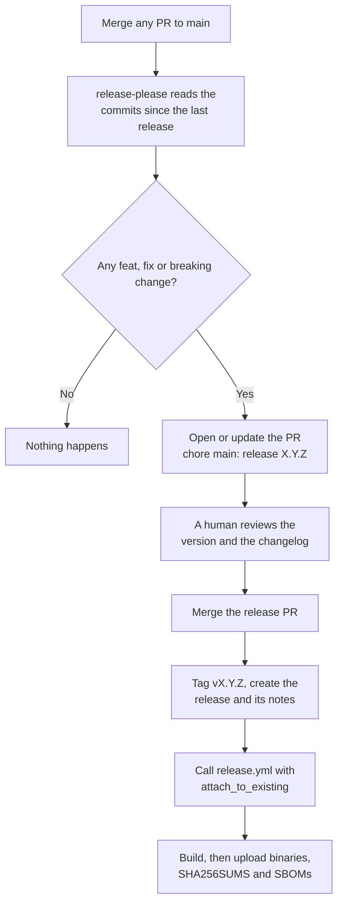
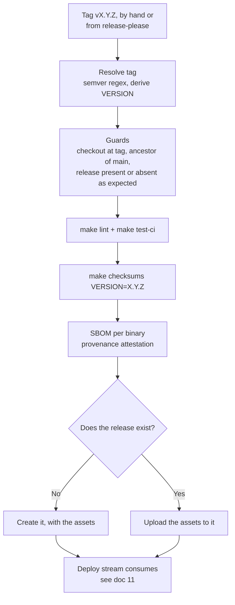

# 12 - Build and release (producing the artefact)

How `vault-plugin-secrets-bifrost` is compiled, verified, and published so a Vault cluster can consume it.

This document covers the **producer** side only. Deploying a published artefact is [11](./11-kubernetes-deployment.md). The contract between the two is restated below; as long as it holds, this stream is free to change how it builds.

## What this stream owns

| Owned here | Not owned here |
|------------|----------------|
| Cross-compilation and its flags | Helm values, `plugin_directory` |
| Publishing release assets | `vault plugin register` / `secrets enable` |
| Version/tag scheme, and deriving it from commit types | Cluster egress and pull credentials |
| Emitting checksums, SBOMs, provenance | Mount paths, roles, engine config |
| Lint and test gates before publishing | Choosing when to upgrade a cluster |

## The artefact contract

Restated from [11](./11-kubernetes-deployment.md) - the only coupling between the streams.

| Property | Value |
|----------|-------|
| Artefact type | GitHub Release assets (native binaries, no registry) |
| Release URL | `https://github.com/globallogicuki/vault-plugin-secrets-bifrost/releases/download/vX.Y.Z/` |
| Binary asset names | `vault-plugin-secrets-bifrost_X.Y.Z_linux_amd64`, `..._linux_arm64` |
| Checksum asset | `SHA256SUMS`, the output format of `sha256sum` (hex, two spaces, filename) |
| SBOM assets | `<binary>.spdx.json`, SPDX JSON, one per binary |
| Provenance | SLSA build provenance attestation per binary, verified with `gh attestation verify` |
| Architectures | `linux/amd64`, `linux/arm64` |
| Version scheme | Tag `vX.Y.Z`; assets carry the bare `X.Y.Z` |
| Tag immutability | Tags are never moved and releases are never re-cut |

Breaking any row is a breaking change for the deploy stream.

`SHA256SUMS` lists both binaries, so the consumer extracts the line it needs rather than being handed a hash out of band.

## How the version is chosen

Versions are derived from [Conventional Commits](https://www.conventionalcommits.org/), the style `CLAUDE.md` already mandates. That style is therefore load-bearing: a mistyped type changes the version, or suppresses a release.

| Commit landing on main | Effect on the next version |
|------------------------|----------------------------|
| `feat:` | Minor bump, `0.1.0` -> `0.2.0` |
| `fix:`, `perf:` | Patch bump, `0.1.0` -> `0.1.1` |
| `feat!:`, or a `BREAKING CHANGE:` footer | Minor while below 1.0.0, major once past it (`bump-minor-pre-major`) |
| `docs:`, `refactor:`, `test:`, `build:`, `ci:`, `chore:`, `style:` | None. No release is proposed. |

`release-please-config.json` holds the rules and the changelog sections. `.release-please-manifest.json` holds the current version and is rewritten by each release commit; it is seeded at `0.1.0` so the first proposal is `0.2.0` rather than release-please's default of `1.0.0`.

To override a computed version once, put a `Release-As: 1.0.0` footer on a commit to `main`.

## Version strings

Three strings exist for one release. The conversion happens in exactly one place, the tag-resolution step of `release.yml`.

| String | At v0.1.0 | Role |
|--------|-----------|------|
| Git tag and release name | `v0.1.0` | The release's identity |
| `VERSION` make variable | `0.1.0` | Build token, used only in filenames |
| Asset filename | `vault-plugin-secrets-bifrost_0.1.0_linux_amd64` | What operators download |
| `vault plugin register -version=` | `v0.1.0` | Vault's plugin catalogue (see [11](./11-kubernetes-deployment.md)) |

The rule: **the `v` belongs to the tag and to Vault's catalogue; the bare `X.Y.Z` belongs to build filenames.** The workflow derives one from the other with `VERSION="${TAG#v}"`, guarded by a semver regex so a malformed tag fails before anything is built.

## Build requirements

These are correctness constraints, not preferences:

| Flag | Why |
|------|-----|
| `CGO_ENABLED=0` | The Vault container image is minimal. A dynamically linked binary fails to exec with `exec format error`. CI asserts each binary is a statically linked ELF. |
| `GOOS=linux` | The plugin runs inside the Vault container, whatever the build host is. |
| `GOARCH` per target | Vault plugins are native binaries. Must match the node pool. |
| `-trimpath` | Removes local filesystem paths, so two builds of the same commit in different directories produce identical bytes. |
| `-ldflags="-s -w"` | Drops symbol/DWARF tables: ~36 MB to ~25 MB. Go build info survives, so `go version -m <binary>` still lists the module graph and the SBOM is complete. |

Any change to these flags changes the binary's SHA256. Since Vault verifies that checksum on **every plugin launch**, the checksum must come from the exact build being shipped - which is the argument for generating binary and checksum in one CI job rather than on a laptop.

`-race` requires cgo, so `CGO_ENABLED=0` is set per build inside the `dist` recipe and never as an environment-wide default. Setting it workflow-wide would break the race detector while leaving `dist` unchanged.

### What reproducibility actually means here

Verified by building the same commit in two independent clean clones at different paths: the binaries were byte-identical.

The binary embeds Go build info, including `vcs.revision`, `vcs.time` and `vcs.modified`. The SHA256 is therefore a function of:

- the commit,
- a clean worktree,
- the Go patch release (`go` directive in `go.mod`),
- `GOOS`/`GOARCH`.

It is **not** a function of source content alone, and `VERSION` affects only the filename, never the bytes. Practical consequences:

- Anyone can reproduce a published checksum: clone, `git checkout vX.Y.Z`, `make checksums VERSION=X.Y.Z` on the pinned Go version.
- A build from a **dirty** tree sets `vcs.modified=true` and will not match, by design.
- A build from a linked `git worktree` gets no VCS stamping at all (`mod (devel)`) and will not match either. Use a clone when comparing checksums.
- `go version -m <binary>` names the commit a binary came from, which is why VCS stamping is left on.

## Local build

```sh
make dist VERSION=0.1.0        # cross-compile both arches into ./dist
make checksums VERSION=0.1.0   # the above, plus dist/SHA256SUMS
```

`make checksums` depends on `dist`, so one invocation is enough. Running `make dist checksums` cross-compiles twice.

With no `VERSION` given, the Makefile derives it from the nearest git tag with the leading `v` stripped, falling back to `0.0.0-dev`. That is deliberate: a hand-built binary cannot accidentally be labelled as a release.

## CI

Three workflows, all thin wrappers over `make` so the build flags live in exactly one place.

### Every pull request and push to main - `.github/workflows/ci.yml`

| Job | What it runs |
|-----|--------------|
| `lint` | `make lint` (gofmt assertion + `go vet`), `make mod-check`, then golangci-lint |
| `test` | `make test-ci` (race detector, coverage into the run summary) |
| `build` | `make build`, then the real `make dist`, then asserts both binaries are statically linked ELF |

Three jobs rather than one, so a lint failure cannot mask a test failure. The `build` job calls the release build path rather than its own compile loop, so a cross-compilation break surfaces on the pull request instead of on a tag.

### On a merge to main - `.github/workflows/release-please.yml`

Releasing takes two merges, with a human between them.



The release PR is the approval gate, and it accumulates: every further merge to `main` rewrites its version and changelog until it is merged or closed. So a merge to `main` never publishes on its own - merging the release PR does.

`release.yml` is invoked with `uses:` rather than left to fire on the tag push. **A tag or release created with `GITHUB_TOKEN` does not trigger other workflows** - GitHub's recursive-workflow prevention - so a tag trigger would silently do nothing here. Calling it directly keeps the build logic in one file and needs no PAT or GitHub App token.

One consequence: release-please creates the release *before* the binaries exist, so for a few minutes the release is visible with no assets. If the build then fails, the release stays asset-free. See the playbook.

### Building and publishing - `.github/workflows/release.yml`

One job, so the binaries and their checksums are produced by the same run. Three entry points, one code path:

| Entry point | Creates the release | Publishes |
|-------------|---------------------|-----------|
| Called by `release-please.yml` - the normal path | No, it already exists | Yes |
| A `vX.Y.Z` tag pushed by hand | Yes | Yes |
| `workflow_dispatch` | Yes, unless `dry_run` | Only when `dry_run=false` |

The hand-pushed tag path stays for two reasons: the first release has to be cut before release-please has anything to count from, and a prerelease rehearsal such as `v0.1.0-rc.1` is not a decision Conventional Commits should be making.



Every guard runs before any build work and publishing is the last step, so a failure leaves nothing half-released:

1. **Tag shape.** Must match `vX.Y.Z` or `vX.Y.Z-prerelease`. This also rejects a tag crafted to inject shell.
2. **Checkout at the tag**, never at a branch head.
3. **Ancestry.** The tagged commit must be an ancestor of `origin/main`, so a release cannot be cut from a stray branch.
4. **Release existence, in whichever direction applies.** When creating, the release must *not* exist: `softprops/action-gh-release` would happily *update* one, so this guard is what enforces the immutability row of the contract. When attaching, it must exist - absence means the caller passed a tag that was never released.
5. **Lint and test.** Repeated here because a tag can point at a commit that never went through `ci.yml`.

A tag containing a hyphen is published as a prerelease and does not become "latest", so `v0.1.0-rc.1` is a safe full-fidelity rehearsal. release-please never produces one.

Assets are listed explicitly rather than globbed from `dist/`, so a broken `VERSION` derivation fails the run instead of publishing mislabelled files. The attach path checks each expected file is present before uploading, because `gh release upload` has no equivalent of `fail_on_unmatched_files`.

### Rehearsing a release

`release.yml` also accepts `workflow_dispatch` with a `tag` and a `dry_run` flag that defaults to true. A dry run exercises tag resolution, the ancestry guard, lint, test, the cross-compile, checksums and SBOM generation, and publishes nothing - no release, no assets, no attestation. Checksums appear in the run summary.

### Failure playbook

| When it failed | What to do |
|----------------|------------|
| Before the release was created | Re-run. Nothing was published. |
| While attaching assets to a release-please release | Re-run the `publish` job. Uploads use `--clobber`, and the install notes are appended only once, guarded by a marker - so a re-run is safe. |
| After a hand-cut release was created | Do not re-cut. Publish a new patch tag. |
| Guard rejected the tag | Fix the tag name, or the branch it points at, and tag again. |
| release-please proposed the wrong version | Close the release PR, or override it with a `Release-As: X.Y.Z` footer on a commit to `main`. |

## Deferred: the OCI image

An earlier revision of this document made the artefact a binary-only OCI image, delivered into Vault pods by an init container that copied `/plugin/vault-plugin-secrets-bifrost` into `plugin_directory`.

That has been dropped. Vault `exec`s a native binary from `plugin_directory` and never pulls an image, so the image was only a transport. Publishing the binaries plus `SHA256SUMS` as release assets was already the last step of the pipeline, and removing the image also removes the two decisions that were blocking a first release: which registry, and what package visibility.

Re-adopt the image when a cluster needs it, which is likely when:

- the cluster has no egress to `github.com`, so an internal registry is the only reachable source, or
- the platform team prefers digest-pinned image references over URL downloads.

Two improvements to make at that point:

- Compute the checksum during `make dist` and `COPY` it in, rather than running `sha256sum` inside the image.
- Use `COPY --chmod=0755` instead of a `RUN chmod`.

Together those leave a `FROM scratch`-style image with no `RUN` steps at all, which removes the need for QEMU emulation when building the non-native architecture.

## Considered and deferred

| Option | Why not now |
|--------|-------------|
| **GoReleaser** | Would re-implement the `dist` flag set in a second place. Any drift silently changes the binary's SHA256, which Vault checks on every launch. The `Makefile` stays the single source of build logic. |
| **cosign signatures** | GitHub's build provenance attestation already gives a verifiable, keyless chain from binary to workflow run, with no key to manage. Add cosign only if a consumer's policy engine requires that specific format. |
| **Coverage gate** | Coverage is reported in the run summary, not enforced. A threshold can be added later as one `make` target without touching CI. |

## Platform note

The repository is hosted on **GitHub** (`github.com/globallogicuki/vault-plugin-secrets-bifrost`), so GitHub Actions runs against it directly with no secrets to configure: the built-in `GITHUB_TOKEN` creates the release and uploads assets, and the provenance attestation uses the workflow's OIDC identity.

The repository is public, which is what makes attestations available - they otherwise require GitHub Enterprise Cloud for private or internal repositories. If the repository is ever made private, drop the attestation step and its `id-token`/`attestations` permissions; `SHA256SUMS` alone still satisfies everything Vault needs.

GitLab CI cannot run against a GitHub-hosted repository. Using it would first require a GitHub -> GitLab pull mirror and a GitLab project to own the pipeline. Because both CI files would be thin wrappers over the same `make` targets, switching later is cheap - the build logic deliberately lives in the `Makefile`, not in CI YAML.

## Hardening not yet applied

| Control | Effect |
|---------|--------|
| Tag protection ruleset on `v*` | Enforces tag immutability in the forge itself, rather than only in the workflow guard. |
| `CODEOWNERS` on `.github/` | Stops a change to the publishing workflow landing without review. |

## Related

- [11](./11-kubernetes-deployment.md) - consuming the artefact in Kubernetes
- [08](./08-testing-and-dev.md) - test layers and the CI gates
- [09](./09-roadmap.md) - phased delivery
